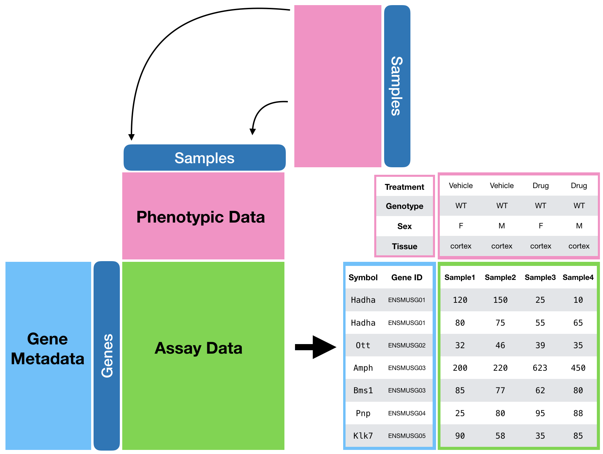
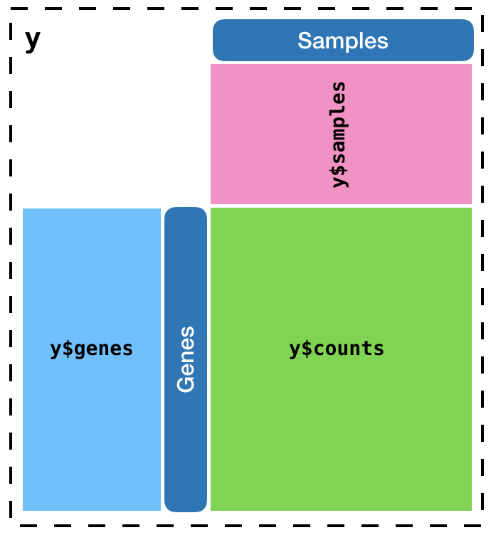

```{r setup, include = FALSE}
library(dplyr)
library(ggplot2)
theme_set(theme_bw())
source("tutorial-helpers.R")
knitr::opts_chunk$set(
  collapse = TRUE,
  comment = "#>"
)
```

# Overview

This document is meant to be worked on together in the classroom. We outline
some of the basic steps of a complete RNA-seq analysis by performing the
following:

1. Assembling the raw we have mapped with Kallisto into an analyzable form
2. Performing an initial QC of the dataset
3. Performing your first differential expression analysis
4. Interpreting the result from (3)
5. Using gene sets and gene set enrichment analysis (GSEA) in addition to
   "vanilla" differential expression to assist with the interpretation of
   your experiment.

## Caveats

### There is no joy without suffering

There are sections of this analysis document that are not filled in. This is
intentional, because we will work on these parts together in the class. 

You are meant to struggle through these things so we can:

1. *discover* the answer (no spoon feeding); and
2. perhaps learn more elegant ways to get to it

We understand that this will be very frustrating at times, but trust that:

1. we will get through this together (sleep be damned); and
2. deep down inside, we will be better people for it

### A little joy never hurt nobody

1. For your **future reference**, we have included a sister tutorial in this
   package ("Analysis of RNA-seq data (complete)") which "fills in the holes"
   of this one This can act as a document you can use as reference in the future
   to remind yourself how we performed a "soup to nuts" analysis of this data.
   
   There are other references online that provide workflows for RNA-seq analysis
   that you should also refer to in the future. You will find many examples and
   points of discussion here are liberraly borrow from these sources:
   
   i. [From reads to genes to pathways: differential expression analysis of
       RNA-Seq experiments using Rsubread and the edgeR quasi-likelihood
       pipeline][qlftut]
   ii. [RNA-seq analysis is easy as 1-2-3 with limma, Glimma and edgeR][glimmatut]
   iii. [Analyzing RNA-seq data with DESeq2][deseq2tut]

2. We have provided helper functions in this package to assist with different
   parts of the analysis. These functions start with the `mbl_*` prefix and are
   provided as a crutch so that we can quickly draw certain types of plots, or
   munge certain types of data together.
   
   i.  **We aim to teach you how to make these plots or munge these data 
       without the use of these helper functions by the end of this course**
   ii. These `mbl_*` functions won't disappear, and you can refer (or use)
       them for your future analyses.

3. **One more thing about plotting.** In a later class, we will introduce a
   powerful and (eventually) intuitive system of visualizing data in R using
   the [ggplot2 pakage](http://ggplot2.tidyverse.org). This package provides a
   composable grammar of data visualization that you can use to quickly build
   up arbitrarily detailed plots.
   
   i. There will be code in this tutorial that uses `ggplot` to plot graphics.
      We will explain a bit about this "live," but you will learn more about it
      in a class coming soon.
   ii. the `mbl_*` plotting functions in this package use ggplot2, and you can
      look at that source code as a reference.

## Goal of Differential Expression Analysis

We have performed manipulations to groups of samples (replicates) and want to
understand how these manipulations effect our samples. To measure this effect,
we have chosen to use a "ruler" that measures gene expression estimates of all
of the genes per sample (RNA-seq).

The goal of a differential expression analysis is to identify the **individual**
genes that exhibit **statistically significant** differences in their
**mean expression estimates**.

**Note that** *statistical significance* **does not equal biological
significance**.

### Simple Example

Suppose we want to understand the effect of knocking out an ion channel on the
gene expression profiles taken from Merkel cells. To explore this effect, you
isolate Merkel cells from three WT mice, and three KO mice and perform RNA-seq
on these samples.

We may identify results that land into three broad categories, as outlined
below:

```{r, fig.height = 3, fig.width = 7.6}
exdat <- example_dge_data()
ggplot(exdat, aes(x = condition, y = expression)) +
   geom_boxplot() +
   geom_point() +
   facet_wrap(~ gene)
```

* **Gene A** shows clear differential expression. The mean expression of this
  gene in WT mice is much higher than in KO mice.
* **Gene B** shows questionable differential expression. Although the mean
  gene expression between the two groups is clearly different, there is a
  higher **variance** in these expression estimates, so it's not clear that
  future replicate measurements will show these to be different, or similar.
* **Gene C** the mean expression of these genes between conditions doesn't
  look to be different.

### Formal Assessment of Differential Gene Expression

To address the issues diagrammed above, we will apply statistical tools
developed specifically for RNA-seq data to:

1. estimate the mean differenes in expression between groups of replicate
   samples
2. incorporate the variance in the expression estimates to provide p-values
   for the statistical significance of this mean difference given the this
   variance.

The statistical framework we will use for these analyses is based on
[linear models](https://en.wikipedia.org/wiki/Linear_model).

In your prior encounters with statistics, you may have heard of (or used) things
like [t-tests][ttest] or [ANOVA][anova] ... you can think of inear models are
super-charged versions of these methods.

## Data Setup

To perform an analysis of gene expression data, we have **three** different
sources of data that we want to merge together.



1. The processed RNA-seq data: aka our **assay data**. This consists of a matrix
   of gene-level counts for each sample across our entire experiment. The rows
   of this matrix refer to the individual genes, and the columns refer to the
   individual samples samples. A the value in a given `(x,y)` entry of this
   matrix tells us the number of reads that align to gene `x` in sample `y`.

2. A `data.frame` (table) of **phenotypic data**. The rows of this table refer
   to the different experiments, so there are **as many rows here as there are
   columns in our assay data**. The columns of this table contain the variety of
   covariates we are tracking for these samples, ie. things like:
   
   i. the `"treatment"` condition of the sample;
   ii. the `"genotype"` of the cell(s) (or animal(s)) used in the sample;
   iii. the `"source/tissue"` the sample was taken from;
   iv. the animial identifier for the mouse that sample was taken from
       (you might extract samples from different organs of an animal);
   iv. the person who prepared the libraries for the sample;
   v. the time of day the sample was run;
   vi. the RIN score for the sample;
   vii. etc.

3. A `data.frame` (table) of **gene-level data**. The rows of this table refer
   to the genes quantitated in our experiment, so there are **as many rows here
   as there are rows in our assay data**. The columns provide the information
   we know about these genes, such as:
   
   i. their official [ensembl identifier][ensid]
   ii. official gene name/symbol
   iii. "biotype" (protein coding, lincRNA, etc.)

### Why?

The main reason to package your data in this way is that it now becomes easier
to handle and manipulate.

We will put store these three pieces of data into a variable `y`, which is
a `DGEList`. A `DGEList` is simply a `list()` object (remember those(?))
with a bit more know-how.

1. The **assay** data is retrieved via `y$counts`.
2. The **phenotype data** is retrieved via `y$samples`
3. The **gene-level data** is retrieved via `y$samples`

This means that our data will now be accessible like so:

```{r, out.width = "300px"}
# 

```

We will learn how to build these objects from our data. We have also provided
helper functions inside this `mbl2018` R package that allow you to retrieve
pre-generated datsets, and will use the mouse data for this.

First we load the `mbl2018` R package, and retrieve the `"mouse"` dataset.

```{r, message=FALSE, warning=FALSE}
library(mbl2018)
y <- mbl_load_rnaseq(organism = "mouse", dataset = "may")
is(y)
```

Let's take a peak at our gene counts in `y$counts`

```{r}
head(y$counts)
```

**Try to take a peak at the sample and gene inormation to see what type of
information we have**

### Manipulating a DGEList

Although a single `DGEList` internally carries a number of different pieces of
data, we can still think of this as a **two-dimensional** object that
we can manipulate (like a `data.frame`, or a `matrix`).

The rows of this pseudo-2D object correspond to the genes, and the columns are
the samples:

```{r}
dim(y)
```

```{r}
head(rownames(y))
```

```{r}
head(colnames(y))
```

In your analyses, you will find cause to remove some genes or samples from
downstream analysis, and you can index into this object like other 2D objects
in R. For instance, let's say we only want data for the first, tenth, and
twentieth gene, and the first five samples:

```{r}
y2 <- y[c(1, 10, 20), 1:5]
dim(y2)
```

**Take a look at the assay, gene-level, and sample phenotypic data to confirm
that everything was subsetted correctly.**

# Build Your Own DGEList

In a previous session, you learned how to use Kallisto to align FASTQ files.
You then combined this with some shell scripting mojo to automate the
quantitation of all of the samples into an output directory.

While you were wrestling with those tasks, we also "baked" these data and have
made them available to you in the `s3://mbl.data/mapping/may` directory.

Let's take a look at what's in there by listing the contents of this bucket.
You will find a "Terimanl" tab in one of the panes of your RStudio IDE. You
should find it in the same window pane that has the "Console". This is just
like the "Chrome Terminal" you have been using, so let's go there and list
the contents of this directory:

```bash
$ aws s3 ls s3://mbl.data/mapping/may/
#                           PRE fish/
#                           PRE fly/
#                           PRE mouse/
```

We will start by assembling the mouse data first, which we will use as the basis
for the rest of this tutorial. When we are done, you can come back and tweak
this code.

Staying inside the Terminal, run the following command to sync the aligned
mouse data to your machine:

```bash
$ aws s3 sync s3://mbl.data/mapping/may/mouse ~/may-mouse-kallisto
```

**Take a peak in the directory you just created to confirm its contents.**

**What do you see?**

**NOTE: There is a bug with this terminal, let's close this terminal together
and open a new one**

## Sample Phenotypic Data

An important part of conducting a successful experiment is to ensure that you
keep the information about the samples you collect in a "tidy format". We
introduced the idea of tidy data earlier.

* The main concepts are summarized in
  [this Wikipedia page](https://en.wikipedia.org/wiki/Tidy_data#Characteristics)
* A full explanation of "tidy data" can be found in the "R or Data Science" book,
  which is freely available online. [This is a direct link to the chapter that
  explains Tidy Data](http://r4ds.had.co.nz/tidy-data.html).
* A gateway to the "tidyverse" for more information
  [is here][https://www.tidyverse.org].

We have provided an example of a phenotypic data table or these mouse
experiments that you can load into your workspace:

```{r}
pheno <- read.csv("~/may-mouse-kallisto/sample-information.csv",
                  stringsAsFactors = FALSE)
```

Take a peak at the `pheno` table:

* `rownames()`
* Why do we have a `group` columns?
* **Assume we didn't provide a `group` column, can you reconstruct its values
  and store them in a `group2` column on the `pheno` table?

This table will end up becoming our `y$samples` table.

## Transcript and Gene Information Table

Recall that we used Kallisto to "align" our reads to a transcriptome index.
Kallisto's output will be a count table **at the transcript level**. 

We need two things:

1. To be able to summarize individual transcript level counts to gene level
  counts.
2. To retrieve metadata about these transcripts (and genes), ie. gene symbol,
   "biotype", etc.

These types of tables are retrievable from many sources. For convenience, we
have made it easily available via a helper function in this package:

```{r, message=FALSE}
txinfo <- mbl_get_transcript_annotation("mouse")
```

**Take a peak**

## Assay (count) data

We need to process the Kallisto output into a count matrix. Fortunately there
is a package for that!

We will use the [Biconductor `tximport` package][tximport] for this task.

**Take a minute to:**

1. Browse to the [tximport website][tximport]
2. Scroll down to the "**Documentation** section, and open the
   "Importing transcript abundance datasets with tximport" vignette for a quick
   skim.
3. Load the `tximport` package, and skim the help file in `?tximport`

**We need to specify the paths to the kallisto output files for each sample**

We'll use `dir` to explore the filesystem (don't have to jump to terminal) and
will use the `paste` function to concatenate strings.

```{r}
# dir() and paste()
```

1. Turn mouse Kallisto quant results into a matrix of gene-level data using
   [tximport][tximport]. Need a vector that points to the `abundance.h5` files
   for each sample.

```{r, eval = FALSE}
txi <- tximport(files, type = "kallisto", tx2gene = tx2gene,
                countsFromAbundance = "lengthScaledTPM")
```

2. TODO: Create DGEList out of everythiing

3. TODO: Redraw ExpressionSet image with `y$counts`, `y$genes`, `y$samples`
   labels.

# Quality Control

In addition to the read-level quality control you already did with FastQC and
MultiQC, there are a number of ways to explore the quality of our data now that
it has been summarized to gene-level expression estimates per sample.

## Effective Sequencing Depth

How many reads actually aligned to the features (genes) we are analyzing here?

1. TODO: barplot of `lib.size`
2. TODO: barplot of `lib.size` per group

## Principal Component Analysis

TODO: Show simple example of 2d correlated measurements, rotate and project to
1D.

Fun interactive tutorial here: http://setosa.io/ev/principal-component-analysis/

## Heatmaps

TODO: Heatmaps

## QC Conclusion

3. TODO: identify crazy outliers and remove those samples

# Differenial Gene Expression

1. Introduce design matrix
   i. explains experiment (`~ 0 + group`)
   ii. call `lmFit` and show `fit$coefficients`
   iii. `mbl_plot_expression` of genes and show 1:1 match to (ii)
   
2. Introduce contrast as doing arithmetic over columns of the design matrix
3. Run DGE!
4. Introduce alternate paramterization with intercept
   i. show `fit$coefficients`, use `mbl_plot_expression` to eyeball logFC
      calc off of columns vs intercept

5. Use (4) paramaterization to find tissue specific genes
   - [Omnibus test][omnibus]: test whether the explained variance in a set of
     data is significantly greater than the unexplained variance, overall.

6. Draw heatmap of (5)
   i. use `mbl_heatmap` but explain further customization with `ComplexHeatmap`

# GSEA

multiGSEA reuses what we learned above but gives you much bang for your back

[//]: # References =============================================================

[anova]: https://en.wikipedia.org/wiki/Analysis_of_variance
[deseq2tut]: http://bioconductor.org/packages/release/bioc/vignettes/DESeq2/inst/doc/DESeq2.html
[ensid]: https://uswest.ensembl.org/Help/Faq?id=488
[glimmatut]: https://f1000research.com/articles/5-1408/v2
[omnibus]: https://en.wikipedia.org/wiki/Omnibus_test
[qlftut]: https://f1000research.com/articles/5-1438/v2
[ttest]: https://en.wikipedia.org/wiki/Student%27s_t-test
[tximport]: http://bioconductor.org/packages/tximport

